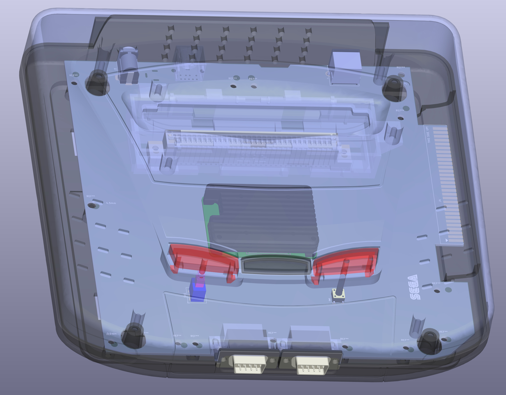
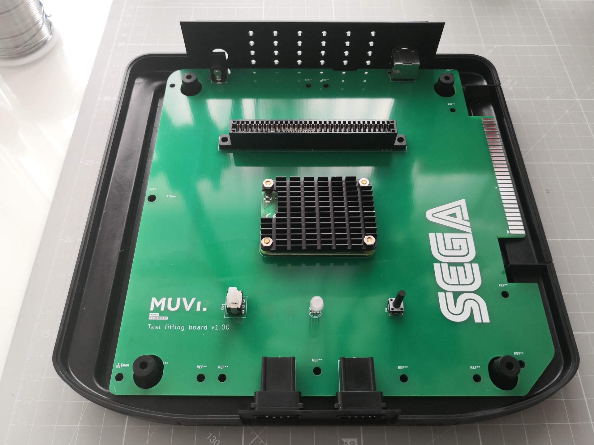

Contact us for the master files! :-) info@muvi.gal

Revisions:
1. PCB CM4 pi
2. PCB 32X+MD2 og components (destructive 1-time only)
3. PCB hybrid FPGA + current available components (discarded)
4. PCB FPGA TRION+STM32+SDRAM

