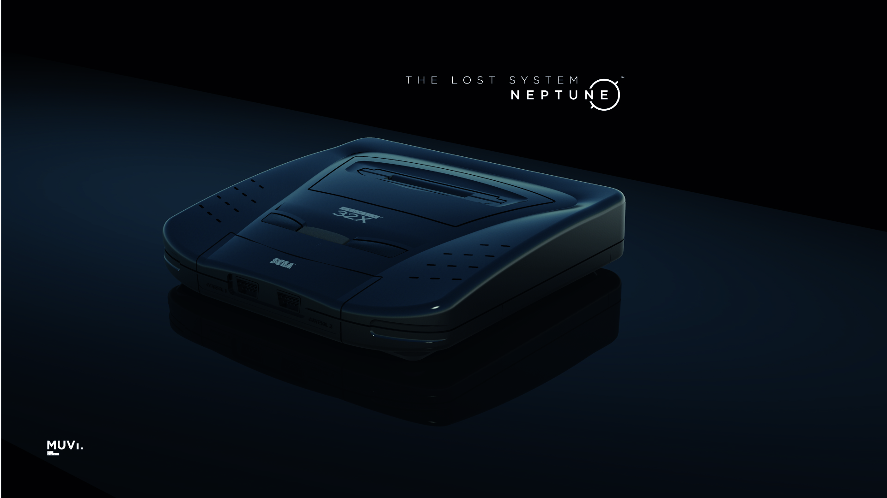
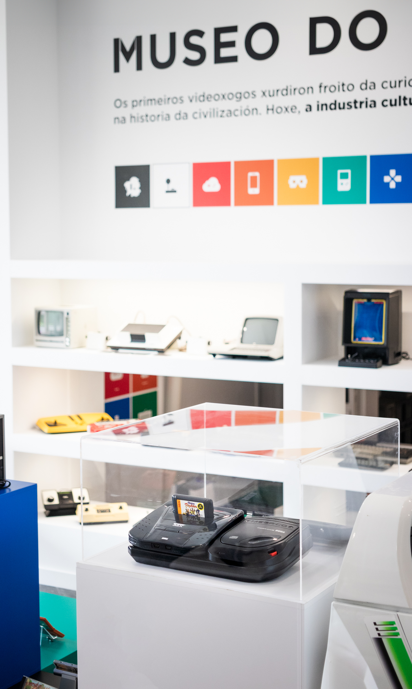
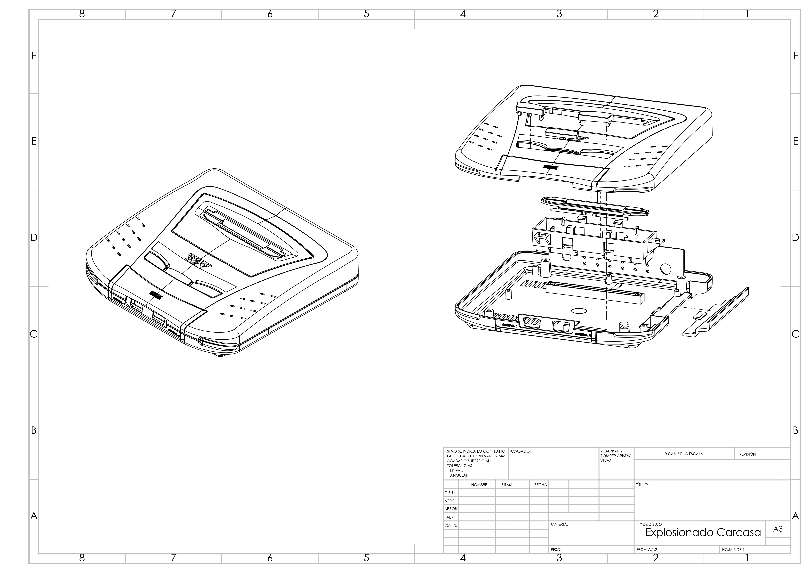

# A SEGA NEPTUNE chega ao MUVI.

A Fundación Museo do Videoxogo de Galicia presenta a réplica do prototipo “Project Neptune” —GENESIS 32X— de SEGA, nun proxecto de investigación e preservación activa que continúa en proceso de desenvolvemento. 

Hoxe, como entidade con proxección social, compartimos este apaixoante avance: os arquivos mestres do modelado paramétrico 3D que inclúen datos coas medidas e información técnica, ademais da imaxe corporativa de SEGA  / GENESIS 32X en formato vectorial. Todo o necesario para desenvolver esta réplica dende cero.

## ACCESO A SEGA NEPTUNE MUVI:

O repositorio co material continuará a medrar progresivamente, aberto á comunidade, culminando nunha versión final da Sega Neptune que permanecerá exposta no Museo do Videoxogo coas súas capacidades funcionais orixinais ao 100%, a escala 1:1 e nun acabado “Admodum perfectum”: o modelo que a compañía do ourizo azul tería ofrecido en 1995. 

**_Agradecemos á Escola Universitaria de Deseño Industrial da UDC, aos deseñadores industriais e profesores que seguen apoiando ao MUVI no desenvolvemento de proxectos de preservación replicativa. A FrikiConsolero e a Marty (https://www.museodelvideojuego.com/) e por suposto aos compañeiros do MUVI que continúan a traballar na procura de novas formulacións de vangarda no eido da preservación do videoxogo. Hoxe abrimos o proxecto a todo aquel que quera traballar connosco. Contacta aquí ou en info@muvi.gal_**

Para rematar, queremos expresar o noso apoio e celebración do lanzamento do sistema GF1 Neptune da compañía GamesCare dentro dun par de días. Sorte!

# La SEGA NEPTUNE llega al MUVI.

La Fundación Museo do Videoxogo de Galicia presenta la réplica del prototipo "Project Neptune" —GENESIS 32X— de SEGA, en un proyecto de investigación y preservación activa que continúa en proceso de desarrollo.
Hoy, como entidad con proyección social, compartimos este apasionante avance: los archivos maestros del modelado paramétrico 3D que incluyen datos con las medidas e información técnica, además de la imagen corporativa de SEGA / GENESIS 32X en formato vectorial. Todo lo necesario para desarrollar esta réplica desde cero.

## ACCESO A SEGA NEPTUNE MUVI:

El repositorio con el material continuará creciendo progresivamente, abierto a la comunidad, culminando en una versión final de la Sega Neptune que permanecerá expuesta en el Museo do Videoxogo con sus capacidades funcionales originales al 100%, a escala 1:1 y en un acabado "Admodum perfectum": el modelo que la compañía del erizo azul habría ofrecido en 1995.

**_Agradecemos a la Escuela Universitaria de Diseño Industrial de la UDC, a los diseñadores industriales y profesores que siguen apoyando al MUVI en el desarrollo de proyectos de preservación replicativa. A FrikiConsolero, a Marty (https://www.museodelvideojuego.com/), Ramón Méndez  y por supuesto a los compañeros del MUVI que continúan trabajando en la búsqueda de nuevas formulaciones de vanguardia en el campo de la preservación del videojuego. Hoy abrimos el proyecto a todo aquel que quiera trabajar con nosotros. Contacta aquí o en info@muvi.gal_**

Para terminar, queremos expresar nuestro apoyo y celebración del lanzamiento del sistema GF1 Neptune de la compañía GamesCare dentro de un par de días. ¡Suerte!

# The SEGA NEPTUNE arrives at MUVI

The Museo do Videoxogo de Galicia Foundation is proud to present the replica of SEGA’s “Project Neptune” —GENESIS 32X— prototype, in an ongoing research and preservation project still in development.

Today, as an entity with social impact, we share an exciting advance: the master files of the 3D parametric modeling including measurements data and technical information, as well as SEGA / GENESIS 32X’s corporate image in vector format. Everything that is needed to develop this replica from scratch.

## ACCESS TO MUVI SEGA NEPTUNE:

The repository will keep growing over time, open to the community, and culminating in a final version of the Sega Neptune that will remain on display at the Museo do Videoxogo fully functional with its original capabilities, at 1:1 scale and in an “Admodum perfectum” finish: the model that the blue hedgehog’s company would have released in 1995. 

**_We thank the University School of Industrial Design at Universidade da Coruña (UDC), the industrial designers and professors who keep supporting MUVI in the development of replicas for preservation projects. Thanks as well to FrikiConsolero and Marty (https://www.museodelvideojuego.com/) and of course to the colleagues at MUVI who keep working and on the lookout for new cutting-edge formulations in the field of video game preservation. Today, we are opening the project to anyone who wants to work with us. Contact us here or at info@muvi.gal_**

Lastly, we want to express our support and celebration for the launch of the GF1 Neptune system from GamesCare, which will take place in a couple of days. Good luck!

# Media/documents:

## [Presentation here](00_PRESENTATION/README.md)

## [Photos here](01_PHOTOS/README.md)

## [3D prototype CAD here](03_3D_PROTOTYPE/README.md)

## [Corporate image here](04_CORPORATE_IMAGE_32XGENESIS/README.md)

## [PCBs and firmware here](05_PCB/README.md)

# LICENSE
Until further license updates all rights are reserved (for each licensee).
Copyright 2019-2024 Museo Do Videoxogo de Galicia (MUVI)

Please attribute the copyright on your projects in written attribution and add a thank you note on Instagram (@museodovideoxogo) and X (@MuseoVideoxogo),
thank you all for your collaboration.

You will need to contact us as an organization to obtain the CAD/CAM/Firmware/HDL master files.

